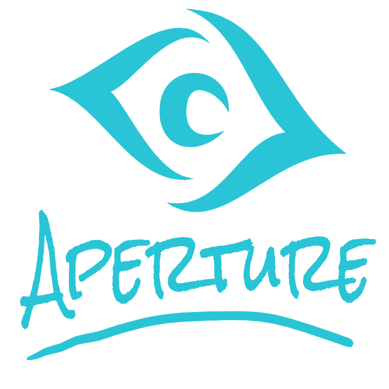

  

# Aperture

### Semillero de Data Science e IA

*No solo estudiamos la IA. La construimos y la llevamos a la realidad.*

---

## ¿Qué es Aperture?

Aperture es una comunidad estudiantil construida en torno al Data Science y la
Inteligencia Artificial. Convertimos la teoría en proyectos de valor y aprendemos
a escalarlos hasta que funcionen de verdad en el mundo real.

Sin requisitos previos: lo único que pedimos son ganas de aprender y de construir.

## Líneas de trabajo

- **Data Science** — análisis, estadística y minería de datos.
- **Machine Learning** — del notebook al ML en producción.
- **IA & LLMs** — transformers, agentes de IA y RAG.
- **High Performance Computing** — GPU programming (CUDA) y cómputo a escala.

## Súmate

- Instagram — [@aperture.systems](https://www.instagram.com/aperture.systems/)
- WhatsApp — [únete al grupo](https://chat.whatsapp.com/Bi83DY3f9tDCSMHDUqyHDM)
- Correo — [aperture.systems.lab@gmail.com](mailto:aperture.systems.lab@gmail.com)
- Website - [conoce nuestra website](https://aperture-systems-lab.github.io/aperture/)
